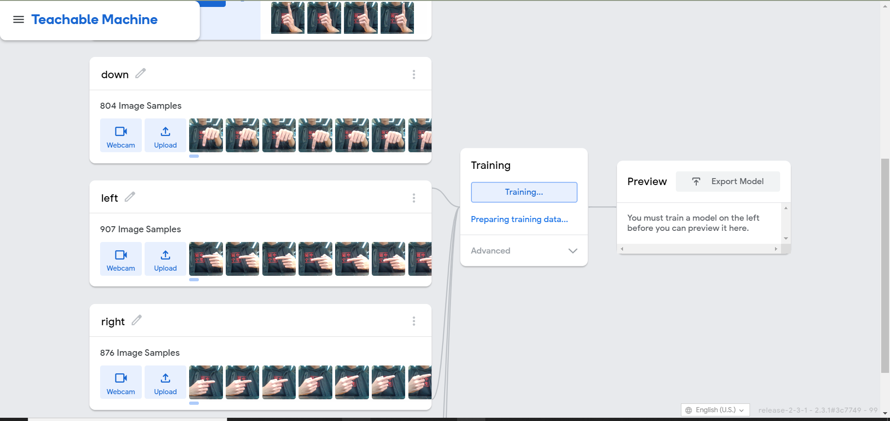
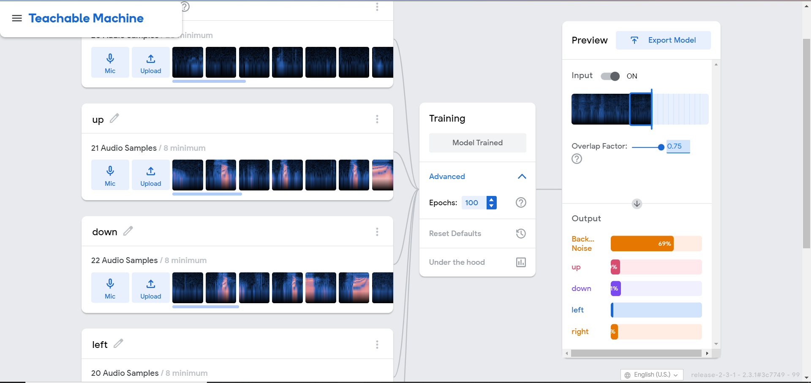

### 实验目标

- 发挥个人创作力和想象力，独立完成一个人工智能创意小应用。
- 优秀的同学可以不仅限于图像的分类，可通过Teachable Machine平台扩展应用到声音、姿态等应用。
- 了解分类神经网络的原理，并对人工智能有初步了解。
- 学有余力的同学可以尝试用python编写一些简单识别分类网络，如手写数字识别等。

---
### 项目简介
本次作业我结合 Google Teachable Machine 平台提供的AI模型，利用JavaScript编写了一个简单的贪吃蛇小游戏。

由于之前在学习JavaScript编程时，简单实现过一个[贪吃蛇小游戏](https://github.com/DinoMax00/JS-Snake/tree/master/snake-practice)，所以本次作业中想到了在之前代码的基础上加入 Google Teachable Machine提供的图像、语音分类模型来代替上下左右键控制，实现效果类似于AR体感游戏。

游戏整体沿用了寒假写的贪吃蛇游戏的界面，并用p5.js重构了控制部分代码，大概用时三四天独立完成，代码上传至[github](https://github.com/DinoMax00/JS-Snake/tree/master/AI-homework01)。

---
### 游戏方法
* 打开主目录中的index.html进入游戏界面(需要配置localhost)，或者访问已经部署好的[demo](https://dinomax00.github.io/homework01/)

使用本地打开时，可能需要改写./scripts/main.js中的以下代码，更改localhost后的端口，当然也可以使用第二行中的远程访问模型(音频识别模型路径直接使用'./my_model'会报错)。
    ```javascript
    let soundModel = 'http://localhost:63342/homework01/my_audio_model/';
    // let soundModel = 'https://teachablemachine.withgoogle.com/models/7OxN2ehlO/';
    ```

* 待左下角视频窗口加载出图像后，点击左边栏的三个选项切换游戏模式


* 三种模式分别为:

    **KeyBoard Control**:默认模式，I,K,J,L键控制上下左右。

    **Gesture Control**:根据手势控制移动，上下左右分别为

    **Audio Control**:根据语音控制移动

* 按空格键开始游戏，游戏过程中左下角窗口下方会显示当前识别的手势方向，游戏窗口上方显示当前蛇运动的方向。

* 游戏与传统贪吃蛇的区别之处为，由于AI识别灵敏度并不高，有些时候会导致蛇乱跑，所以没有设置游戏失败判定并且降低了蛇的移动速度。

* 语音模式四种声音为："上"、"下"、"左"、"右"

* 四种控制方向的手势为
  
  
  
  

* 为了提升识别效果，手势识别模式尽量不要露脸，语音识别环境音尽量安静。

---
### 模型训练

手势识别模型：


声音识别模型：


---
### 代码实现

在main.js中利用p5.js的global mode实现一个p5对象负责连接AI模型()，并用instance mode实现另一个p5对象来处理游戏逻辑。

**AI部分**其实就是把Google Teachable Machine提供的样例代码稍作改动，并把训练好的模型下载到本地调用。

部分代码：
```JavaScript
// Classifier Variable
let classifier;
let audio_classifier;
// Model URL
let imageModelURL = './my_model/';
let soundModel = 'http://localhost:63342/homework01/my_audio_model/';
// let soundModel = 'https://teachablemachine.withgoogle.com/models/7OxN2ehlO/';

// Video
let video;
let flippedVideo;
// To store the classification
let label = "";

// Load the model first
function preload() {
    classifier = ml5.imageClassifier(imageModelURL + 'model.json');
    audio_classifier = ml5.soundClassifier(soundModel + 'model.json');
}

function setup() {
    frameRate(100);
    let myWindow = createCanvas(videoWidth, videoHeight);
    myWindow.parent("aiWindow");
    // 图像检测
    video = createCapture(VIDEO);
    video.size(videoWidth, videoHeight);
    video.hide();

    flippedVideo = ml5.flipImage(video);

    // 图像检测
    classifyVideo();
    // 声音检测
    audio_classifier.classify(audio_gotResult);
}

```
**游戏逻辑部分**主要是解决两个问题：
① 手势识别模式中，AI模型会时刻对画面进行采样，并返回一个方向值，但识别出的方向并不是每次都准确，所以可能会造成蛇乱跑的问题。

我采用的解决方法是，以20次画面识别为一组，每次选择这20次中被识别最多次的方向作为蛇的移动方向，这样只要模型识别的准确率不是太低，就能得到正确的方向。

```JavaScript
// 更新方向计数
function countDirection(direct){
    if(controlMode!=="gesture")
        return;
    switch(direct){
        case "up":
            upNum++;
            break;
        case "down":
            downNum++;
            break;
        case "left":
            leftNum++;
            break;
        case "right":
            rightNum++;
            break;
    }
    dirCnt++;
}

function updDirection(){
    if(dirCnt<sampleTime) return;
    if(upNum>max(downNum, max(leftNum, rightNum))) direction = "up";
    else if(downNum>max(upNum, max(leftNum, rightNum))) direction = "down";
    else if(leftNum>max(downNum, max(upNum, rightNum))) direction = "left";
    else if(rightNum>max(downNum, max(leftNum, upNum))) direction = "right";
    // 计数器清零
    dirCnt = upNum = downNum = leftNum = rightNum = 0;
}
```
②对不同的控制模式进行区分

只需要维护一个全局变量controlMode来记录当前模式，每中控制模式的相应函数在改变方向时都检测一下controlMode的值是否符合要求。

---
### 有待解决的问题

- 最大的问题还是在识别的准确度上，手势识别中每种手势都提供了接近两千张照片，包含我和其余两个同学。虽然最终训练结果对我的手势识别已经非常准确，但其他同学的测试效果依然很差，甚至不同的衣服作为背景也会很大的影响识别效果。原因应该是训练集的设置不合理，使得训练出的模型无法对不同人的手型等因素进行识别。但是当尝试继续扩大训练集后，网页端的teachablemachine会出现卡顿崩溃等问题，希望在之后课上学习到其他的AI算法后可以继续优化我的模型。

- 为了避免助教和老师运行项目的识别效果不好，所以配备了简单的演示视频。

- 语音模型上的问题在于识别模型采样比较慢，导致反应会有延迟，并不是很灵敏。
